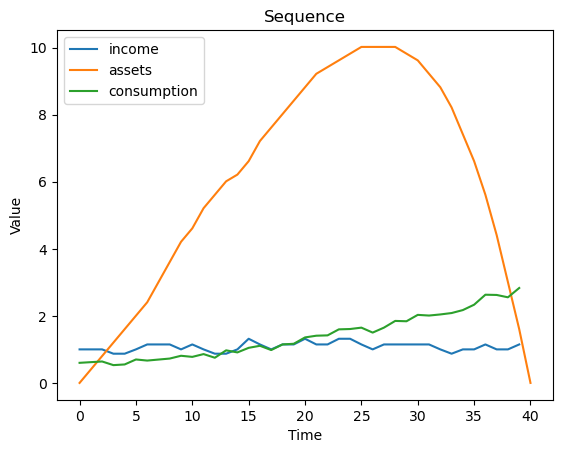
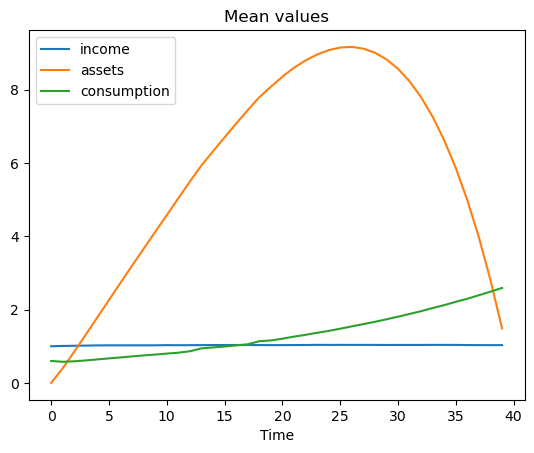
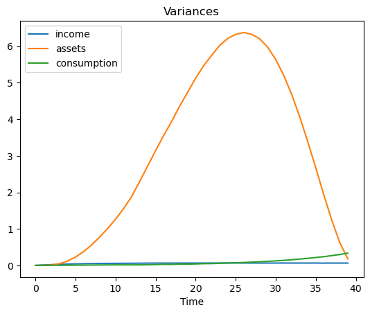
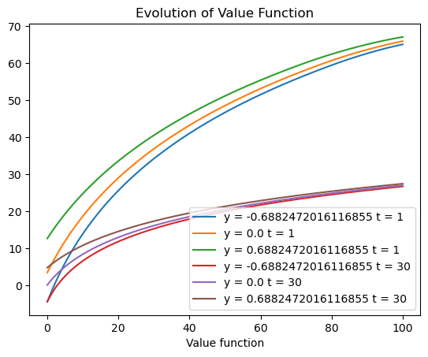
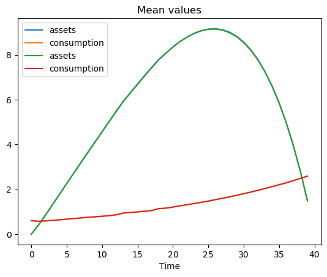

```python
import numpy as np
import matplotlib.pyplot as plt
import scipy
import copy
from numpy import inf
import time
from tqdm import tqdm 

```


```python
### Discretizing an AR(1) stochastic process
### y(t) = pho*y(t-1) + e(t) where e(t) ~ N(0,sigma^2)
### n is the number of discrete points

def tauchen(n, pho, sigma):
    sigma_z = sigma/( np.sqrt( 1 - pow(pho,2) ) )
    
    z_max = +3*sigma_z
    z_min = -3*sigma_z
    
    z = [-1]*n
    for i in range(0,n):
        z[i] = z_min + (z_max - z_min)*(i)/(n - 1)
        
    z_mid = [-1]*(n-1)
    
    for i in range(0,n-1):
        z_mid[i] = (z[i+1] + z[i])/2
    
    tra_prob_matrix = np.zeros( shape = (n , n) )
    
    for i in range(0,n):
        for j in range(0,n):
            if(j == 0):
                tra_prob_matrix[i][j] =     scipy.stats.norm.cdf( (z_mid[j]   - pho*z[i])/sigma )
            elif(j == n - 1):
                tra_prob_matrix[i][j] = 1 - scipy.stats.norm.cdf( (z_mid[j-1] - pho*z[i])/sigma )
            else:
                tra_prob_matrix[i][j] = scipy.stats.norm.cdf( (z_mid[j]   - pho*z[i])/sigma ) - scipy.stats.norm.cdf( (z_mid[j-1]   - pho*z[i])/sigma )
    
    disp_tra_prob_matrix = copy.deepcopy(tra_prob_matrix)
    
    for i in range(0,n):
        for j in range(0,n):
            disp_tra_prob_matrix[i][j] = round(tra_prob_matrix[i][j],3)
                    
    return (np.array(z), tra_prob_matrix, disp_tra_prob_matrix)


### Calculates the expected value function (function of non-stochastic state variable b and time t) 
### given current value of y and using the discretized version of the stochastic process of y (transition probability matrix)
def expected_value_function(value_function, trans_matrix, y):    
    return np.dot(value_function, trans_matrix[y,:])

### Calculating the distance between two nD-matrices for the purpose of checking convergence of the value function
### defunct (was created for checking the convergence of value function for solving infinite horizon problem)
def matrix_distance(m1, m2):                
    return np.nanmax(abs(m1 - m2))

### For finding the index in an array (with linearly increasing sequence) which has a number closest to given number 'v'
def closest_index_1d(m, v):
    x = -1
    d = 10000
    for i in range(0,m.shape[0]):
        if ( abs(m[i] - v) <= d):
            d = abs(m[i] - v)
            x = i 
    return x
```


```python
### Defining parameters (given)
r     = 0.05
beta  = 0.99
T     = 40
a_bar = [-40,-10,0]
pho   = 0.9
sigma = 0.1

### User-defined parameters

a_space_start  = a_bar[0]
a_space_end    = 100

a_space_points = 500
y_space_points = 11 # Make sure that it's an odd number

print(f"Dimensions of value function is {a_space_points}x{T}x{y_space_points} = {y_space_points*a_space_points*(T)}" )
print(f"Dimensions of policy function is {a_space_points}x{T}x{y_space_points} = {y_space_points*a_space_points*T}" )

###### Computational solution of the model

### Discretizing the y_space and the stochastic process of income
(y_space, trans_matrix, dtrans_matrix) = tauchen(y_space_points, pho, sigma)

# Index of midpoint of y_space
y_space_mid = int( (y_space_points - 1)/2 ) # y_space[y_space_mid] should be zero if y_space_points is odd

### Discretizing the b_space
a_space = np.array(np.linspace(a_space_start,a_space_end,a_space_points))

### Defining the time space; note that it is already discrete in the model
t_space = np.array(np.linspace(1,T,T))

### Initializing the value and policy functions
value_function  = np.random.normal(size=(a_space.shape[0],t_space.shape[0],y_space.shape[0]))
state_policy_function = np.random.normal(size=(a_space.shape[0],t_space.shape[0],y_space.shape[0])) 


### state-policy function at T = 40 is 0
for i in range(0, y_space.shape[0]):
    for j in range(0, a_space.shape[0]):
        state_policy_function[j,T-1,i] = 0
        
### value-function at T = 40 is ln(y_T + (1+r)*a_T)
for i in range(0, y_space.shape[0]):
    for j in range(0, a_space.shape[0]):
        if( np.exp(y_space[i]) + (1 + r)*a_space[j] > 0):
            value_function[j,T-1,i] = np.log( np.exp(y_space[i]) + (1 + r)*a_space[j] )
        else:
            value_function[j,T-1,i] = -inf  # Arbitrary large negative number


code_start_time = time.time()

### Value function iteration algorithm 
### Iterating through time backwards
for t in range(t_space.shape[0]-2,-1,-1):

    print( "Converging value function for time period : " + str(t_space[t]) )
    
    ### Updating the value function
    for i in range(0,y_space.shape[0]):
        
        ### Calculating expected value function using tauchen's method 
        exp_val  = expected_value_function(value_function, trans_matrix, i)
        
        for j in range(0,a_space.shape[0]):
                
            temp_values = []
            for k in range(0,a_space.shape[0]):
                if( (1+r)*a_space[j] + np.exp(y_space[i]) - a_space[k] > 0 ):
                    temp = np.log( (1+r)*a_space[j] + np.exp(y_space[i]) - a_space[k] ) + beta*exp_val[k,t+1]
                    temp_values.append(temp)
                else:
                    temp_values.append(-inf)
                        
            temp_values = np.array(temp_values)
                
            if( np.nanmax(temp_values) == -inf):
                value_function[j][t][i] = -inf
                state_policy_function[j][t][i] = np.nan
            else:
                ### Updating the value function with the value which maximizes the bellman equation
                value_function[j][t][i] = np.nanmax(temp_values)
                ### Updating the policy function
                ind = np.nanargmax(temp_values)
                state_policy_function[j][t][i] = a_space[ind]
        
print(time.time() - code_start_time)
```

    Dimensions of value function is 500x40x11 = 220000
    Dimensions of policy function is 500x40x11 = 220000
    Converging value function for time period : 39.0
    


```python
### Simulation (single run) of the model (with discretized stochastic process)
def simulation_run(state_policy_function,T,y_space_points,y_space,trans_matrix):

    y1,a1,a_last = 1,0,0

    y_space_mid = int( (y_space_points - 1)/2 ) # y_space[y_space_mid] should be zero if y_space_points is odd
    y_space_indices = np.arange(0,y_space_points,1)

    log_income    = [-10]*T
    log_income[0] = y_space[y_space_mid]

    ### Generating a sequence of log(income) - exogenous
    for i in range(1,T):
        y_curr = np.where(np.isclose(y_space, log_income[i-1] ))[0][0]
        y_next = scipy.stats.rv_discrete(values=(y_space_indices,trans_matrix[y_curr,:])).rvs(size=1)[0]    
        log_income[i] = y_space[y_next]
           
        
    income = np.exp(log_income)

    ### Initializing list for storing asset sequence
    a = [-100]*(T+1)
    a[0] = a1

    ### Initializing list for storing consumption sequence
    c = [-1]*T

    ### Model run
    for i in range(0,T):
    
        x = closest_index_1d(y_space, log_income[i])
        y = closest_index_1d(a_space, a[i])
        a[i+1] = state_policy_function[y][i][x]
        c[i]   =  (1 + r)*a[i] + income[i] - a[i+1]
    
    return (income, a, c)
```


```python
### Sample run of the model (for demonstration purposes)

(y_space, trans_matrix, dtrans_matrix) = tauchen(y_space_points, pho, sigma)
(inc,ass,con) = simulation_run(state_policy_function,T,y_space_points,y_space,trans_matrix)

plt.plot(inc, label = 'income')
plt.plot(ass, label = 'assets')
plt.plot(con, label = 'consumption')

plt.xlabel('Time')
plt.ylabel('Value')
plt.title('Sequence')
plt.legend()
plt.savefig('m40_sample5.png')
```


    

    


```python
### Multiple runs of the model to find the mean and the variance

# Set number of simulations
num_simulations  = 5000
(y_space, trans_matrix, dtrans_matrix) = tauchen(y_space_points, pho, sigma)
simulation_matrix = np.zeros(shape= (num_simulations, T, 3) )

for s in tqdm(range(0,num_simulations)):
    
    (inc,ass,con) = simulation_run(state_policy_function,T,y_space_points,y_space,trans_matrix)
    simulation_matrix[s,:,0] = np.array(inc)
    simulation_matrix[s,:,1] = np.array(ass[:-1])
    simulation_matrix[s,:,2] = np.array(con)
```

    100%|██████████████████████████████████████████████████████████████████████████████████████████████████████████████████| 5000/5000 [02:03<00:00, 40.58it/s]
    


```python
### Plotting the mean of the sequences 
meaned_sim_matrix = np.mean(simulation_matrix, axis = 0)

plt.plot(meaned_sim_matrix[:,0], label = 'income')
plt.plot(meaned_sim_matrix[:,1], label = 'assets')
plt.plot(meaned_sim_matrix[:,2], label = 'consumption')

plt.xlabel('Time')
plt.title('Mean values')
plt.legend()
plt.savefig('m0_mean.png')
```


    

    


```python
### Plotting the variance of the sequences 
var_sim_matrix = np.var(simulation_matrix, axis = 0)

plt.plot(var_sim_matrix[:,0], label = 'income')
plt.plot(var_sim_matrix[:,1], label = 'assets')
plt.plot(var_sim_matrix[:,2], label = 'consumption')

plt.xlabel('Time')
plt.title('Variances')
plt.legend()
plt.savefig('m0_var.png')
```


    

    


```python
### Plotting the value function (when number of t is small)
time_v = 1
for i in range(0,y_space.shape[0]):
    label_p = 'y = ' + str(y_space[i]) + ' t = ' + str(time_v)  
    if(i in [0,y_space_mid,y_space.shape[0]-1]):
        plt.plot(a_space, value_function[ : , time_v - 1 , i ], label = label_p)

time_v = 30
for i in range(0,y_space.shape[0]):
    label_p = 'y = ' + str(y_space[i]) + ' t = ' + str(time_v)    
    if(i in [0,y_space_mid,y_space.shape[0]-1]):
        plt.plot(a_space, value_function[ : , time_v - 1 , i ], label = label_p)

        
plt.xlabel('Assets')
plt.xlabel('Value function')
plt.title('Evolution of Value Function')
plt.legend()
plt.savefig('m0_valuefn.png')


```


    

    


```python
### Not used in the pdf
### Plotting the value function (for different t)
from mpl_toolkits.mplot3d import Axes3D

fig = plt.figure()
ax = fig.add_subplot(111, projection='3d')

x, y = np.meshgrid(a_space, y_space)     # create grid of x, y values
# x, y = np.meshgrid(y_space, b_space)     # create grid of x, y values

print(value_function.shape)
# print(np.swapaxes(value_function[:,40,:],0,1))
print(x.shape,y.shape)

# print
ax.plot_surface(x, y, np.swapaxes(value_function[:,5,:],0,1), cmap='viridis')
# ax.plot_surface(x, y, np.swapaxes(value_function[:,20,:],0,1), cmap='viridis')
# ax.plot_surface(x, y, np.swapaxes(value_function[:,39,:],0,1), cmap='viridis')

# ax.plot_surface(x, y, value_function[:,15,:], cmap='viridis')
# ax.plot_surface(x, y, value_function[:,25,:], cmap='viridis')
# ax.plot_surface(x, y, np.swapaxes(value_function[:,37,:],0,1), cmap='viridis')


# Add labels
ax.set_xlabel('Assets')
ax.set_ylabel('Log(income)')
ax.set_zlabel('Value function')

# Show plot
plt.show()

### Plotting the policy function (for different t)
from mpl_toolkits.mplot3d import Axes3D

fig = plt.figure()
ax = fig.add_subplot(111, projection='3d')

x, y = np.meshgrid(a_space, y_space)     
# ax.plot_surface(x, y, np.swapaxes(state_policy_function[:,5,:],0,1), cmap='viridis')
ax.plot_surface(x, y, np.swapaxes(state_policy_function[:,20,:],0,1), cmap='viridis')
# ax.plot_surface(x, y, np.swapaxes(state_policy_function[:,39,:],0,1), cmap='viridis')

# print(np.swapaxes(state_policy_function[:,39,:],0,1))

# ax.plot_surface(x, y, np.swapaxes(policy_function[:,35,:],0,1), cmap='viridis')

# ax.plot_surface(x, y, policy_function[:,:,15], cmap='viridis')
# ax.plot_surface(x, y, policy_function[:,:,25], cmap='viridis')
# ax.plot_surface(x, y, policy_function[:,:,39], cmap='viridis')

ax.set_xlabel('Assets')
ax.set_ylabel('Log(income)')
ax.set_zlabel('Policy function')

plt.show()
```


```python
meaned_sim_matrix_m0 = copy.deepcopy(meaned_sim_matrix)
```


```python
meaned_sim_matrix_m10 = copy.deepcopy(meaned_sim_matrix)
```


```python
meaned_sim_matrix_m40 = copy.deepcopy(meaned_sim_matrix)
```


```python
### Plotting the mean of the sequences 
meaned_sim_matrix = np.mean(simulation_matrix, axis = 0)

# plt.plot(meaned_sim_matrix_m0[:,0], label = 'income')
plt.plot(meaned_sim_matrix_m0[:,1], label = 'assets')
plt.plot(meaned_sim_matrix_m0[:,2], label = 'consumption')

# plt.plot(meaned_sim_matrix_m40[:,0], label = 'income')
plt.plot(meaned_sim_matrix_m40[:,1], label = 'assets')
plt.plot(meaned_sim_matrix_m40[:,2], label = 'consumption')

plt.xlabel('Time')
plt.title('Mean values')
plt.legend()
plt.savefig('m0_mean.png')
```


    

    


```python

```
