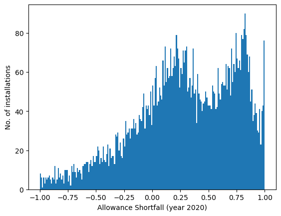
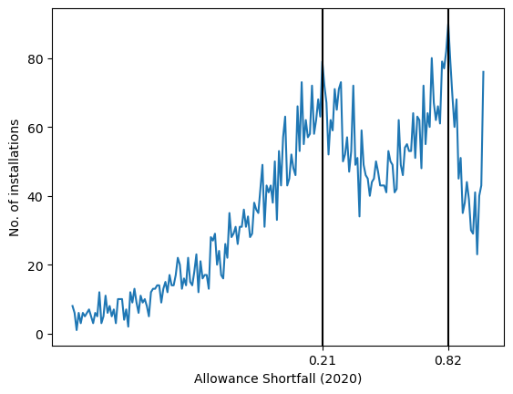
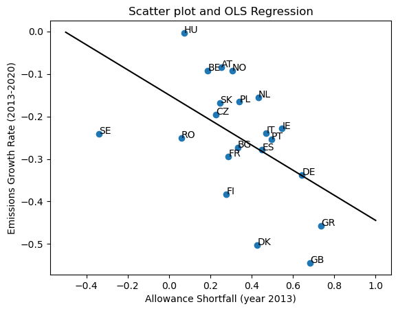
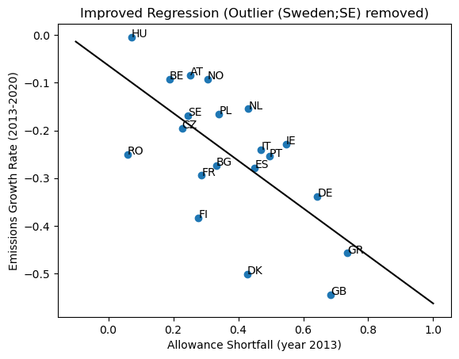

```python
### Importing relevant packages
import pandas as pd
import matplotlib.pyplot as plt
import numpy as np
import statsmodels.api as sm
### Turn off some warnings in pandas
pd.options.mode.chained_assignment = None  # default='warn'

```


```python
### Loading the data
installation_data = pd.read_csv('./Data/installation.csv')
compliance_data   = pd.read_csv('./Data/compliance.csv')
```


```python
### Printing the name of the columns for later reference
print(installation_data.columns)
print(compliance_data.columns)
```

    Index(['id', 'name', 'addressmain', 'postalcode', 'city', 'country_id',
           'latitudegoogle', 'longitudegoogle'],
          dtype='object')
    Index(['installation_id', 'year', 'free', 'emission'], dtype='object')
    


```python
### Compliance Data for the year 2020
compliance_2020 = compliance_data.loc[compliance_data['year'] == 2020]

### Calculating the shortfall (in year 2020) for all the units
compliance_2020['allowance_shortfall'] = ( compliance_2020['emission'] - compliance_2020['free'] ) / compliance_2020['emission']

### Total number of units in 2020
print("Total number of units in 2020 : " + str(compliance_2020.shape[0]) )

### Number of firms whose emissions in 2020 were zero 
print("Number of firms whose emissions in 2020 were zero : " + str( (compliance_2020['emission'] == 0).sum() ) )

### Keeping -1 to 1 values
allowance_shortfall_2020_m1_1 = np.array ( compliance_2020 [ (compliance_2020['allowance_shortfall'] >= -1) &  (compliance_2020['allowance_shortfall'] < 1)] ['allowance_shortfall'] )

### Descriptive statistics
# Number of installation having shortfall in [-2, -1)
allowance_shortfall_2020_m2_m1 = np.array ( compliance_2020 [ (compliance_2020['allowance_shortfall'] < -1) & (compliance_2020['allowance_shortfall'] >= -2)] ['allowance_shortfall'] )

# Number of installation having shortfall in (-inf, -2)
allowance_shortfall_2020_inf_m2 = np.array ( compliance_2020 [ (compliance_2020['allowance_shortfall'] > -np.inf) & (compliance_2020['allowance_shortfall'] < -2)] ['allowance_shortfall'] )

# Number of installation having shortfall of 1
allowance_shortfall_2020_1 = np.array ( compliance_2020 [ (compliance_2020['allowance_shortfall'] == 1)] ['allowance_shortfall'] )

print("Installations which have shortfall in the range (-inf, -2) : " + str(allowance_shortfall_2020_inf_m2.shape[0] ) )
print("Installations which have shortfall in the range [-2, -1) : " + str(allowance_shortfall_2020_m2_m1.shape[0] ) )
print("Installations which have shortfall in the range [-1, 1) : " + str(allowance_shortfall_2020_m1_1.shape[0] ) )
print("Installations which have shortfall of 1 : " + str(allowance_shortfall_2020_1.shape[0] ) )

### Plotting the histogram
val = plt.hist(allowance_shortfall_2020_m1_1, bins=200)
plt.xlabel('Allowance Shortfall (year 2020)')
plt.ylabel('No. of installations')
plt.savefig('histogram.png')
```

    Total number of units in 2020 : 10671
    Number of firms whose emissions in 2020 were zero : 613
    Installations which have shortfall in the range (-inf, -2) : 789
    Installations which have shortfall in the range [-2, -1) : 280
    Installations which have shortfall in the range [-1, 1) : 7317
    Installations which have shortfall of 1 : 1672
    


    

    


```python
### Number of units which have zero free allowances 
print("Number of units which have zero free allowances :", compliance_2020 [ compliance_2020['free'] == 0 ].shape[0] )

### Histogram drawn in the form of line plot (and finding the peaks)
plt.plot(val[1][0:200], val[0])
plt.xlabel('Allowance Shortfall (2020)')
plt.ylabel('No. of installations')
plt.axvline(x=0.21, color='black')
plt.axvline(x=0.82, color='black')
plt.xticks(ticks=[0.21, 0.82])
plt.savefig('histogram_line.png')
```

    Number of units which have zero free allowances : 1672
    


    

    


```python
### Checking the hypotheses that first two characters of the installation id 
### can be used to identify the country of the installation
installation_data['check_id'] = installation_data['id'].str.slice(stop=2)

### One entry does not follow the hypothesis
# print( ( installation_data['check_id'] == installation_data['country_id'] ).sum(), installation_data.shape[0])

### That entry does not much sense (might be an error)
# print( installation_data [ installation_data['check_id'] != installation_data['country_id'] ] )

### Apart from this entry, country_id can be inferred from the frist two characters of the installation id
### Removing that entry from the compliance_data, if it exists there
invalid_entry = installation_data [ installation_data['check_id'] != installation_data['country_id'] ]['id']
invalid_entry = np.array (invalid_entry) [0]
print("Invalid entry : ",end = '')
print(invalid_entry)

compliance_data_clean = compliance_data [ (compliance_data['installation_id'] !=  invalid_entry) ]

### Creating a column having country id
compliance_data_clean['country_id'] = compliance_data_clean['installation_id'].str.slice(stop=2)

### Filtering data for the year 2013
compliance_data_clean_2013 = compliance_data_clean[ compliance_data_clean['year'] == 2013 ]
### Aggregating country-level emissions for year 2013
country_emissions_2013 = compliance_data_clean_2013.groupby(['country_id']).sum()[['free', 'emission']].sort_values(['emission'], ascending = False)

### List of countries having their emissions greater than 20 millions of C02 in the year 2013
select_countries = country_emissions_2013[ country_emissions_2013['emission'] > 20000000 ].index.to_list()

### Selecting data of relevant countries and calculating thier allowance shortfall (year 2013)
select_country_allowance_emissions_2013 = country_emissions_2013[ country_emissions_2013.index.isin(select_countries) ]
select_country_emissions_2013 = select_country_allowance_emissions_2013['emission']
select_country_allowance_emissions_2013['allowance_shortfall'] = (select_country_allowance_emissions_2013['emission'] - select_country_allowance_emissions_2013['free'])/select_country_allowance_emissions_2013['emission'] 
select_country_allowance_shortfall_2013 = select_country_allowance_emissions_2013['allowance_shortfall']

### Filtering data for the year 2020 and getting emissions data for relevant countries 
compliance_data_clean_2020 = compliance_data_clean[ compliance_data_clean['year'] == 2020 ].groupby(['country_id']).sum()[['free', 'emission']]
select_country_emissions_2020 = compliance_data_clean_2020[ compliance_data_clean_2020.index.isin(select_countries) ]['emission']

### Renaming the data-series for later convenience
select_country_emissions_2020.rename('emissions_2020',inplace = True)
select_country_emissions_2013.rename('emissions_2013',inplace = True)

### Calculating emissions growth rate between 2013 and 2020
select_country_emissions_2013_2020 =  pd.concat([select_country_emissions_2013, select_country_emissions_2020], axis=1)
select_country_emissions_2013_2020['emission_growth'] = (select_country_emissions_2013_2020['emissions_2020'] - select_country_emissions_2013_2020['emissions_2013'])/select_country_emissions_2013_2020['emissions_2013']
select_country_emissions_growth_2013_2020 = select_country_emissions_2013_2020['emission_growth']
 
### Prepaing data for the scatter plot
y = np.array(select_country_emissions_growth_2013_2020.sort_index())
x = np.array(select_country_allowance_shortfall_2013.sort_index())

### Displaying table for latex purposes
# print( pd.concat( [select_country_emissions_growth_2013_2020.sort_index(), select_country_allowance_shortfall_2013.sort_index()], axis = 1).to_latex(
#                   float_format="{:.3f}".format))  

### Running OLS regression
X = sm.add_constant(x)
model = sm.OLS(y, X)
results = model.fit()
# print(results.summary().as_latex())
print(results.summary())
# print(results.params)

### Plotting the regression line and the scatter plot
x_values = np.linspace(-0.5, 1, 100)  
y_values = results.params[0] + results.params[1] * x_values

fig, ax = plt.subplots()
ax.scatter(x, y)
plt.savefig('scatter.png')


select_countries.sort()
# iso2_codes = pd.read_excel('./data/iso_2digit_alpha_country_codes.xls', skiprows = 2)
# # print(iso2_codes.columns)
# select_countries_fullname = []
# for i in range(0,len(select_countries)):
#     country_name = iso2_codes[select_countries[i] == iso2_codes['Code Value']]['Definition'].to_list()[0]
# #     print(country_name)
#     select_countries_fullname.append( country_name )

for i, country in enumerate(select_countries):
    ax.annotate(country, (x[i], y[i]))
    
ax.plot(x_values, y_values, color ='black')
plt.xlabel('Allowance Shortfall (year 2013)')
plt.ylabel('Emissions Growth Rate (2013-2020)')
plt.title('Scatter plot and OLS Regression')
plt.savefig('scatter_OLS.png')

```

    Invalid entry : HR_200696
                                OLS Regression Results                            
    ==============================================================================
    Dep. Variable:                      y   R-squared:                       0.260
    Model:                            OLS   Adj. R-squared:                  0.221
    Method:                 Least Squares   F-statistic:                     6.662
    Date:                Thu, 11 Apr 2024   Prob (F-statistic):             0.0183
    Time:                        13:11:18   Log-Likelihood:                 15.328
    No. Observations:                  21   AIC:                            -26.66
    Df Residuals:                      19   BIC:                            -24.57
    Df Model:                           1                                         
    Covariance Type:            nonrobust                                         
    ==============================================================================
                     coef    std err          t      P>|t|      [0.025      0.975]
    ------------------------------------------------------------------------------
    const         -0.1496      0.047     -3.173      0.005      -0.248      -0.051
    x1            -0.2948      0.114     -2.581      0.018      -0.534      -0.056
    ==============================================================================
    Omnibus:                        1.958   Durbin-Watson:                   1.265
    Prob(Omnibus):                  0.376   Jarque-Bera (JB):                1.481
    Skew:                          -0.468   Prob(JB):                        0.477
    Kurtosis:                       2.097   Cond. No.                         4.79
    ==============================================================================
    
    Notes:
    [1] Standard Errors assume that the covariance matrix of the errors is correctly specified.
    


    

    


```python
### Improving the regression 

select_country_mse_emissions_growth_2013_2020 = select_country_emissions_growth_2013_2020[select_country_emissions_growth_2013_2020.index != 'SE']
select_country_mse_allowance_shortfall_2013 = select_country_allowance_shortfall_2013[select_country_allowance_shortfall_2013.index != 'SE']


y = np.array(select_country_mse_emissions_growth_2013_2020.sort_index())
x = np.array(select_country_mse_allowance_shortfall_2013.sort_index())


### Running the OLS Regression
X = sm.add_constant(x)
model = sm.OLS(y, X)
results = model.fit()
# print(results.summary().as_latex())
print(results.summary())
# print(results.params)

### Plotting the regression line 
x_values = np.linspace(-0.1, 1, 100)  
y_values = results.params[0] + results.params[1] * x_values

fig, ax = plt.subplots()
ax.scatter(x, y)

for i, country in enumerate(select_countries[:-1]):
    ax.annotate(country, (x[i], y[i]) )
    
ax.plot(x_values, y_values, color ='black')
plt.title("Improved Regression (Outlier (Sweden;SE) removed)")
plt.xlabel('Allowance Shortfall (year 2013)')
plt.ylabel('Emissions Growth Rate (2013-2020)')
plt.savefig('OLS_v2.png')


```

                                OLS Regression Results                            
    ==============================================================================
    Dep. Variable:                      y   R-squared:                       0.432
    Model:                            OLS   Adj. R-squared:                  0.400
    Method:                 Least Squares   F-statistic:                     13.68
    Date:                Thu, 11 Apr 2024   Prob (F-statistic):            0.00164
    Time:                        13:11:18   Log-Likelihood:                 16.759
    No. Observations:                  20   AIC:                            -29.52
    Df Residuals:                      18   BIC:                            -27.53
    Df Model:                           1                                         
    Covariance Type:            nonrobust                                         
    ==============================================================================
                     coef    std err          t      P>|t|      [0.025      0.975]
    ------------------------------------------------------------------------------
    const         -0.0635      0.056     -1.131      0.273      -0.182       0.054
    x1            -0.4994      0.135     -3.698      0.002      -0.783      -0.216
    ==============================================================================
    Omnibus:                        2.555   Durbin-Watson:                   1.413
    Prob(Omnibus):                  0.279   Jarque-Bera (JB):                2.112
    Skew:                          -0.721   Prob(JB):                        0.348
    Kurtosis:                       2.324   Cond. No.                         6.26
    ==============================================================================
    
    Notes:
    [1] Standard Errors assume that the covariance matrix of the errors is correctly specified.
    


    

    


```python

```
